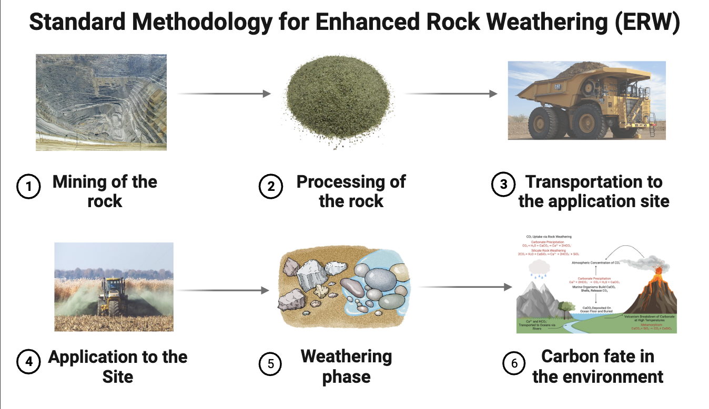
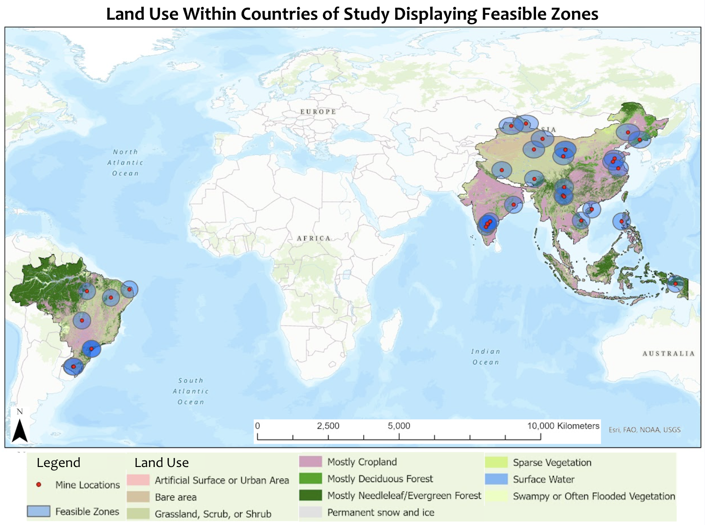

# Unleashing Nature's Climate Hero: Enhanced Rock Weathering

### Introduction
Climate change is a pressing global crisis demanding innovative solutions. Enhanced Rock Weathering (ERW) has the potential to be an innovative solution (Meysman and Montserrat, 2017). ERW speeds up the natural process of turning CO2, the culprit behind global warming, into harmless minerals. 

### ERW: A Natural Process with a Boost
ERW accelerates the natural weathering process, a geological phenomenon through which specific types of rocks are finely ground into a powder and then strategically spread across cropland (Meysman and Montserrat, 2017). Our research primarily focuses on olivine, one of the most abundant rocks on Earth that weather quickly, making it the ideal candidate, though glauconite and pyroxene are also being considered (Hartmann et al., 2013; Bach et al., 2019). This process (Figure 1) dissolves rocks to absorb and lock away CO2 from the atmosphere. Cropland is the application site because it covers extensive areas and can benefit from the rocks releasing plant nutrients (Meysman and Montserrat, 2017).

*Figure 1: A flowchart of the Standard Methodology for ERW outlining the general activity process at a specific site, from rock mining to the dispersion of the stored carbon (Created with Biorender.com).*
 
ERW has the most potential in warm and humid regions like China, India, Southeast Asia, and Brazil (Strefler et al., 2018). These are some of the world's major carbon emitters, so involving them can make climate action more equitable. We created a model to display the regions in which ERW is best and determine the feasibility of ERW to offset global emissions (Figure 2).

*Figure 2: A map from our model of the regions best suited for ERW. Mines that were identified as sources of olivine are shown in red. ERW is the most feasible within a 300 km radius of mines containing olivine due to accessibility and existing infrastructure (Strefler et al., 2018). The best land for ERW is cropland, and the potentially usable options are forested regions. Using only the best land within our feasible zones, ERW can potentially remove 37 gigatonnes of atmospheric CO2 annually. Created through ArcGIS Pro using Esri and ESA (2020) and Hudson Institute of Mineralogy (2023) data.*

### Unlocking the Potential
ERW’s potential benefits are significant and wide-ranging:
* **Reduce atmospheric CO2 concentrations**
  * By reducing atmospheric CO2, ERW can contribute to cooling the planet. This aids in addressing climate change’s effects on weather patterns, sea levels, and ecosystems (Bach et al., 2019).
* **Preserve coral reefs**
  * ERW can help counteract the effects of ocean acidification, a consequence of rising CO2 levels. By enhancing alkalinity and nutrient levels in the ocean, ERW supports the health and preservation of coral reefs, critical ecosystems for marine biodiversity (Caldeira and Wickett, 2003).
* **Enhance crop growth**
  * Releasing nutrients for plants and soil through ERW can significantly improve crop yields. This can bolster food production and enhance food security, particularly in regions where nutrient-deficient soils are an issue (Bach et al., 2019).
* **Provide sustainable land use**
  * Cropland is a primary application site for ERW, using existing infrastructure and contributing to efficient and sustainable land use (Strefler et al., 2018).

### Economic and Environmental Considerations
ERW's potential as a climate solution is promising but comes with important economic and environmental considerations. Several key factors must be carefully addressed to make ERW a viable and responsible option.
* **Efficiency is crucial**
  * Selecting the right types of rocks and implementing responsible mining practices is essential. 
* **Understanding environmental factors**
  * ERW can influence environmental factors such as ocean pH and soil quality. These impacts must be studied and managed responsibly to minimize adverse effects on ecosystems (Taylor et al., 2016).
* **Complexity of element release**
  * ERW can release nutrients that are beneficial for plants and soil, but can also release toxic elements if not managed carefully (Hartmann et al., 2013; Bach et al., 2019). 
* **Infrastructure needs**
  * Large-scale ERW projects require infrastructure, which can result in environmental pollution. The supply chain and energy usage impact ERW’s environmental footprint (Eufrasio et al., 2022).
* **Responsible practices**
  * Rigorous monitoring and careful management are essential to make ERW a truly effective and sustainable tool in the fight against climate change and limit any detrimental effects (Lawford-Smith and Currie, 2017).

### Engaging the Public
We understand that ERW is complex, but we believe in transparency and want to address all public concerns. We need your support by learning about your government’s climate change mitigation policies and informing others about ERW.

### References
Bach, L.T., Gill, S.J., Rickaby, R.E.M., Gore, S. and Renforth, P., 2019. CO2 Removal With Enhanced Weathering and Ocean Alkalinity Enhancement: Potential Risks and Co-benefits for Marine Pelagic Ecosystems. *Frontiers in Climate,* 1, p.7. https://doi.org/10.3389/fclim.2019.00007.

Caldeira, K. and Wickett, M.E., 2003. Anthropogenic carbon and ocean pH. *Nature,* 425(6956), pp.365–365. https://doi.org/10.1038/425365a.

Esri and ESA, 2020. *Land Cover CCI Product User Guide Version 2.Tech. Rep.* [ArcGIS Living Atlas]. Available at: maps.elie.ucl.ac.be/CCI/viewer/download/ESACCI-LC-Ph2-PUGv2_2.0.pdf.

Eufrasio, R.M., Kantzas, E.P., Edwards, N.R., Holden, P.B., Pollitt, H., Mercure, J.-F., Koh, S.C.L. and Beerling, D.J., 2022. Environmental and health impacts of atmospheric CO2 removal by enhanced rock weathering depend on nations’ energy mix. *Communications Earth & Environment,* 3(1), pp.1–13. https://doi.org/10.1038/s43247-022-00436-3.

Hartmann, J., West, A.J., Renforth, P., Köhler, P., De La Rocha, C.L., Wolf-Gladrow, D.A., Dürr, H.H. and Scheffran, J., 2013. Enhanced chemical weathering as a geoengineering strategy to reduce atmospheric carbon dioxide, supply nutrients, and mitigate ocean acidification. *Reviews of Geophysics,* 51(2), pp.113–149. https://doi.org/10.1002/rog.20004.

Hudson Institute of Mineralogy, 2023. *Olivine Group.* [online] Mindat.org. Available through: https://www.mindat.org/min-29264.html#autoanchor9.

Lawford-Smith, H. and Currie, A., 2017. Accelerating the carbon cycle: the ethics of enhanced weathering. *Biology Letters,* 13(4), p.20160859. https://doi.org/10.1098/rsbl.2016.0859.

Meysman, F.J.R. and Montserrat, F., 2017. Negative CO2 emissions via enhanced silicate weathering in coastal environments. Biology Letters, 13(4), p.20160905. https://doi.org/10.1098/rsbl.2016.0905.

Strefler, J., Amann, T., Bauer, N., Kriegler, E. and Hartmann, J., 2018. Potential and costs of carbon dioxide removal by enhanced weathering of rocks. *Environmental Research Letters,* 13(3), p.034010. https://doi.org/10.1088/1748-9326/aaa9c4.

Taylor, L.L., Quirk, J., Thorley, R.M.S., Kharecha, P.A., Hansen, J., Ridgwell, A., Lomas, M.R., Banwart, S.A. and Beerling, D.J., 2016. Enhanced weathering strategies for stabilizing climate and averting ocean acidification. *Nature Climate Change,* 6(4), pp.402–406. https://doi.org/10.1038/nclimate2882.
